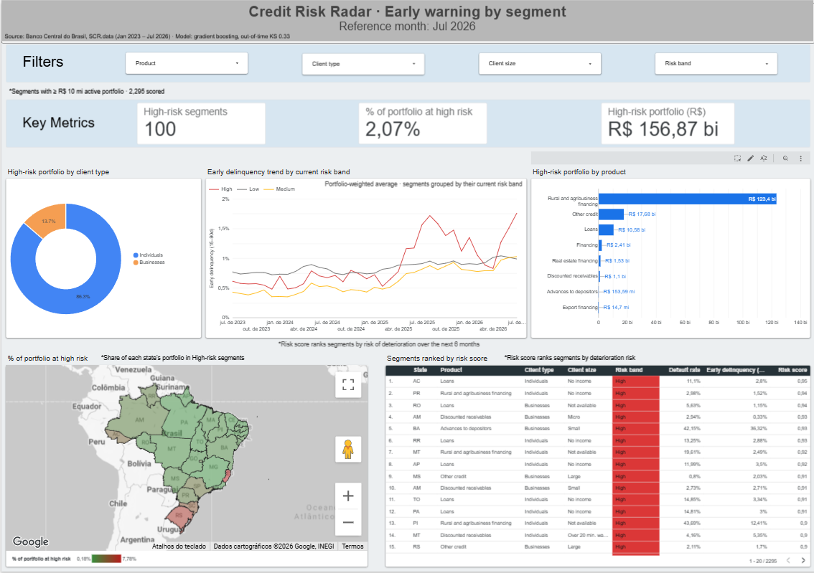

# credito-scr

An end-to-end GCP data pipeline analyzing Brazilian credit delinquency (SCR.data, Banco Central) against the Selic interest rate — built to demonstrate production data engineering on Google Cloud: batch ingestion, managed Dataflow, dimensional modeling in dbt, and scheduled automation.

**Business question:** how does credit default behave across economic sectors and states in Brazil, and how does it relate to Selic rate movements over time?

## Architecture

```
Banco Central (SCR.data, annual ZIP)
   │  requests + zipfile
   ▼
Cloud Storage (raw layer)
   │  Apache Beam
   ▼
BigQuery — staging.scr_data (bronze, source-faithful schema, Portuguese)
   │  dbt (staging model translates to English, this is the only translation seam)
   ▼
BigQuery — marts (star schema: 1 fact + 6 dimensions, dbt-tested)
   │
   ▼
Looker Studio dashboard (default rate × Selic, by sector and by state)
```

Orchestration (both deployed and scheduled, not just designed):
- **Cloud Function** (`scr-data-monthly-ingest`) — checks monthly for a newly published competencia, uploads it idempotently, submits a scoped Dataflow job.
- **Cloud Run Job** (`dbt-run-job`) — runs `dbt build` against BigQuery (models + tests together, fails fast on a bad run), containerized, triggered by Cloud Scheduler ~4h after ingestion.

## Stack and why

| Tool | Role | Why |
|---|---|---|
| Apache Beam / Dataflow | Parse, type, and clean raw CSVs; load to BigQuery | Target role requires Dataflow specifically; DirectRunner for fast local iteration, DataflowRunner once validated |
| BigQuery | Warehouse — staging (bronze) and marts (gold) | Serverless, natural fit for a Beam/Dataflow pipeline on GCP |
| dbt | staging → star schema transformation, with native tests | Formalizes what started as raw SQL into version-controlled, tested models — `not_null`, `unique`, `relationships` on every foreign key |
| Docker + Cloud Build | Packages the dbt project into a reproducible image | Cloud Run Jobs only run containers; the Dockerfile documents the exact runtime, no "works on my machine" |
| Cloud Functions (2nd gen) | Monthly ingestion trigger | Lightweight, reacts to a schedule without a standing server; 2nd gen runs on Cloud Run underneath, so it tolerates a dependency as heavy as `apache-beam[gcp]` |
| Cloud Run Jobs | Scheduled `dbt build` | Built for batch, start-to-finish tasks — the right shape for dbt, unlike a Function meant for short requests |
| Cloud Scheduler | Cron triggers for both automation legs | Deliberately not Cloud Composer — an always-on orchestrator isn't worth its cost for two monthly triggers |
| Looker Studio | Dashboard | Honest substitute for Looker/LookML (no license in this sandbox) — documented as a conscious trade-off, not represented as equivalent |
| Bacen SGS API | Selic target rate, monthly | Official, free, no scraping needed |

## Data model

**Fact:** `fact_credit_operation` — partitioned by `reference_date`, clustered by `state, modality_id`.

**Dimensions:** `dim_date`, `dim_state`, `dim_client`, `dim_credit_modality`, `dim_economic_activity`, `dim_selic_rate`.

**Reporting marts** (pre-aggregated for the dashboard, avoiding Looker Studio blends): `rpt_sector_default_by_month`, `rpt_state_default_by_month`, `rpt_credit_by_state_sector_month`, `rpt_top_sector_default_by_month` (top 8 sectors by exposure, for a readable time-series sample).

All 12 dbt tests pass. `fact_credit_operation` row count matches `staging.scr_data` exactly — no rows silently dropped in the dimension joins.

## What this project is honest about

This isn't a polished-from-the-start build — it's a real sprint, and [`decisions.md`](./decisions.md) is the actual decision log kept throughout: every architecture choice, every bug hit in production (a hardcoded region flag silently overriding a CLI argument, a missing `dbt deps` step in a Docker image, repeated Dataflow zone capacity exhaustion), and how each was diagnosed and fixed — not cleaned up after the fact. A few examples worth reading if you want to see real debugging, not just a finished result:

- **Zone exhaustion, three times** — `ZONE_RESOURCE_POOL_EXHAUSTED` recurring across days, resolved by escalating through zone, machine type, and eventually confirming the fix actually took effect (it initially didn't — a hardcoded `region=` kwarg in the pipeline code was silently overriding the `--region` flag).
- **A join that looked right but wasn't tested for volume** — DirectRunner passed a 5-row sample cleanly, then crashed outright on the full 3.6 GB dataset, which is exactly DirectRunner's real boundary, not a failure of the design.
- **A scope decision made under real business pressure** — BigQuery Sandbox vs. paid billing, decided with a budget cap, not by default.
- **`dbt run` quietly skipping the tests, on the one job that actually needed them** — the Cloud Run Job's Dockerfile ran `dbt run`, which builds every model but runs no tests. That was fine while I was testing by hand in Cloud Shell, but on the real monthly schedule nobody was watching, so a broken test would never have stopped bad data from reaching the dashboard. Switched the entrypoint to `dbt build`, which runs each model's tests right after building it and stops on a failure — the right default for a job nobody supervises. Full reasoning in [`decisions.md`](./decisions.md).
- **Selic as the comparison axis, added mid-sprint without touching the pipeline** — the original scope was credit delinquency by sector; relating it to the Selic rate came later, as a scope change requested mid-build, not planned from day one. Because the transformation layer was already in dbt by the time this came up, adding it meant: one new `source()` block pointing at a small externally-loaded table (`fetch_selic.py` → `dim_taxa_selic`), one new `dim_selic_rate` model to translate it into the project's naming convention, and a `left join` added to the reporting marts that needed it. Nothing upstream — the ingestion pipeline, the fact table, the existing dimensions — was touched or re-run. The same pattern repeated when sector-level and state-level cuts were added, and again when the two were combined into `rpt_credit_by_state_sector_month`: each was a new model plumbed in via `ref()`, not a rewrite of what already worked. That's the practical case for dbt on a project like this — not "it's what the job listing asked for," but that a mid-sprint scope change stayed a small, additive diff instead of a risk to everything already tested and passing.

## Early warning: segment-level credit deterioration model

On top of the star schema, a behavior-style model flags **which credit segments are likely to deteriorate in the next 6 months** — the portfolio-monitoring question credit risk teams review monthly.

**What it is, and what it isn't:** SCR.data is aggregated, with no individual borrower, so this is a **portfolio/segment-level** model, not a borrower-level application or behavior score. Full reasoning in [`decisions.md`](decisions.md).

```
fact_credit_operation ─┐
dim_credit_modality ───┼─► ew_segment_month ─► ew_features ─► train_early_warning.py ─► marts.ew_segment_scores
dim_client ────────────┘   (segment × month)   (features ≤ t,     (OOT validation,          (latest month,
dim_selic_rate ───────────────────────────────►  target at t+6)    logistic vs. GBM)          risk band per segment)
```

- **Segment:** state × credit modality × client type × client size, ≥ R$ 10 mi active portfolio.
- **Target:** default rate at t + 6 rises ≥ 0.5 p.p. and ≥ 15% vs. month t.
- **Key signal:** early delinquency (15–90 days overdue), which rolls into 90+ default.
- **Validation:** out-of-time, no overlap between training targets and the test window; KS, Gini, ROC AUC, PR-AUC and decile lift.

**Results (out-of-time):**

| Model | ROC AUC | Gini | KS | PR-AUC |
|---|---|---|---|---|
| Logistic regression (baseline) | 0.5615 | 0.1230 | 0.0861 | 0.3535 |
| Gradient boosting | 0.7216 | 0.4432 | 0.3301 | 0.4853 |

Top decile: 55.5% of segments deteriorated vs. a 28.8% base rate (1.9x lift); bottom decile 2.3%. Early delinquency (15-90 days overdue) is by far the strongest feature. Selic adds nothing to ranking: it has the same value for every segment in a given month, so it shifts the level of default, not which segment deteriorates.

Full output, decile table and feature importance: `reports/early_warning_metrics.md`.

Run it:

```
cd dbt_credito_scr && dbt build --select +ew_features
cd .. && pip install -r scripts/requirements-ml.txt
python scripts/train_early_warning.py
```

## Dashboard

**Live report:** [Credit Risk Radar on Looker Studio](https://datastudio.google.com/reporting/4b52f307-8544-4474-93cf-360eacd17ceb)



One page for the monthly risk review, reading the scores of the latest reference month (Jul 2026):

- **Key metrics:** high-risk segments, share of the portfolio they hold, and its size in R$.
- **Map:** share of each state's portfolio in high-risk segments.
- **Breakdowns:** high-risk portfolio by client type and by product.
- **Trend:** early delinquency (15-90 days) of each current risk band since Jul 2023, weighted by portfolio. The High band starts pulling away from Medium and Low in 2025.
- **Watchlist:** all 2,295 scored segments, ranked by risk score, filterable by product, client type, client size and risk band.

Data comes from two BigQuery views kept in [`sql/looker_views.sql`](sql/looker_views.sql): one translates the Central Bank labels to English, the other aggregates the trend by risk band.

What the dashboard does not show: monthly forecast values. The model ranks segments by the risk of deteriorating within the next 6 months; it does not predict monthly delinquency rates, so no line is projected past the last real month.

## Running it

Ingestion:
```bash
python scripts/ingest_raw.py
python scripts/beam_pipeline.py --input "gs://<bucket>/raw/scr_data/*/*.csv" --runner=DataflowRunner --project=<project> --region=<region> ...
python scripts/fetch_selic.py
```

Transformation:
```bash
cd dbt_credito_scr
dbt deps
dbt build
```

See `decisions.md` for full context on every flag and design choice above.
